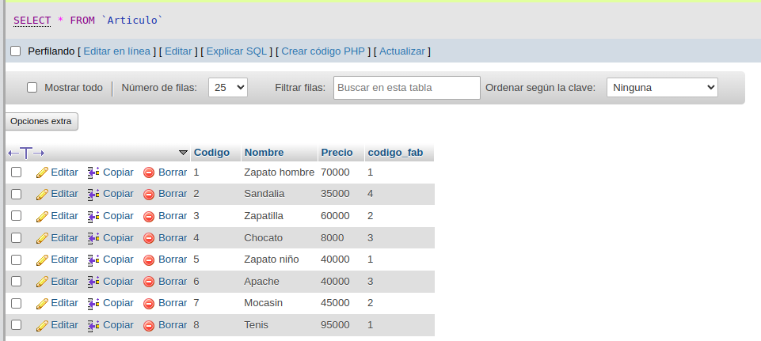
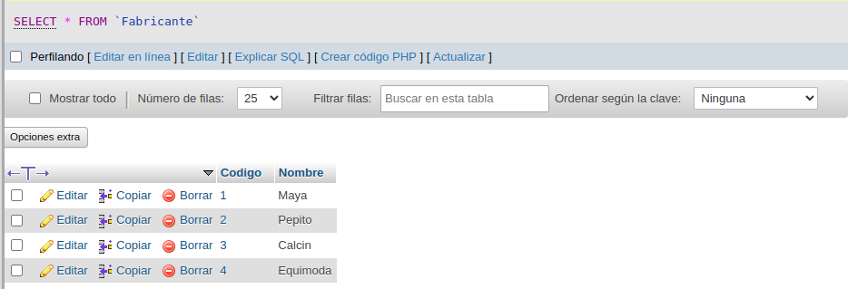
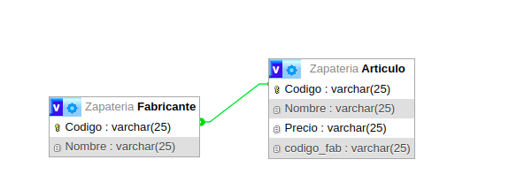

# ejercicio_sql

Tablas: 
Fabricante: codigo, nombre
Articulo: codigo, nombre, precio, codigo_fab

Entre las dos tablas existe una relación uno a muchos, teniendo un fabricante muchos articulos.
18:4009
Crear repositorio en github e ir agregando en el README pantallazos de los pasos de la creación de la BD, las tablas y la relacion entre las tablas.

Tabla Fabricante:
1, Maya
2, Pepito
3, Calcin
4, Equimoda

Tabla Articulo:
1, Zapato hombre, 70000, 1
2, Sandalia, 35000,4
3, Zapatilla, 60000,2
4, Chocato, 8000, 3
5, Zapato niño, 40000, 1
6, Apache, 40000, 3
7, Mocasin, 45000,2
8, Tenis, 95000,1

## Tabla Articulo

## Tabla Fabricante

## Relacion Entre las tablas

## Estructura fabricate
